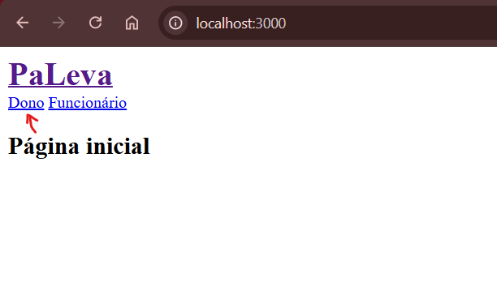

# PaLeva - Gestão de Restaurantes

PaLeva é uma solução completa para a gestão de restaurantes, permitindo o controle de cardápios, pratos, bebidas, pedidos e muito mais. Com uma interface amigável e recursos que facilitam o dia a dia dos estabelecimentos, PaLeva permite que você foque no essencial: entregar uma experiência de qualidade aos seus clientes.

## Recursos

- **Gestão de Cardápios**: Criação e organização de cardápios personalizados com pratos e bebidas.
- **Controle de Estoque**: Registre e acompanhe porções e ingredientes.
- **Pedidos e Status**: Permite realizar e acompanhar pedidos, indicando o status de cada item.
- **Registro de Preços**: Histórico de preços por prato ou bebida para análise de custos e ajustes.
- **Interface de Autenticação**: Gerenciamento seguro de usuários e restrição de funcionalidades.

## Pré-requisitos
1. **setup**:
   - Ruby 3.1+
   - Rails 7.2.1+
   - SQLite 

2. **gems instaladas**:
   - gem "devise", "~> 4.9"
   - gem "cpf_cnpj"
   - gem "rack-cors"
   - gem "rspec-rails"
   - gem "capybara"

## Instalação

1. **Clone este repositório**:
   ```bash
   git clone https://github.com/CristianoSantan/paleva_tdev.git
   cd PaLeva
   ```

2. **Instale as dependências**:
   ```bash
   bundle install
   ```

3. **Configure o banco de dados**:
   Configure o arquivo `database.yml` conforme as necessidades do seu ambiente. Em seguida, crie e migre o banco de dados:
   ```bash
   rails db:create
   rails db:migrate
   ```
   Também é possível rodar as seeds para popular o banco com dados iniciais:
   ```bash
    rails db:seed
   ```

4. **Execute o servidor**:
   ```bash
   rails server
   ```

5. **Acesse a aplicação**:
   Abra seu navegador e acesse `http://localhost:3000` para ver o PaLeva em funcionamento.

6. **Login no Sistema**:
   Para se logar com o usuário criado pelas seeds, use os seguintes dados, este é um usuario do tipo dono de estabelecimento, então basta entrar na aplicação e fazer login no link de dono:

   - Email: `freddie@burgerqueen.com`
   - Senha: `password1234`

   

## Uso Básico

- **Cadastro e Login**: Para acessar todas as funcionalidades, registre-se como administrador do restaurante.
- **Configuração do Restaurante**: Complete o cadastro do restaurante após o primeiro acesso, uma etapa obrigatória.
- **Gestão de Cardápios**: No painel inicial, crie novos cardápios, adicione pratos e bebidas, e organize os itens conforme necessário.
- **Histórico de Preços e Porções**: Visualize e atualize os preços dos itens sem apagar registros anteriores e gerencie porções específicas para pratos e bebidas.
- **Pedidos**: Use a tela de cardápios para realizar pedidos.
